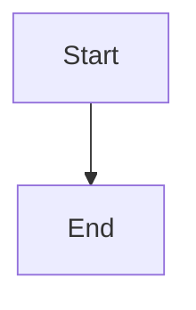

# Agent Context — strugglinghistorian.me

## What this project is

A personal blog and portfolio site for **Cedrick Jumtock (Namkat Cedrick)**, built with [Hugo](https://gohugo.io) and hosted on Vercel at [strugglinghistorian.me](https://strugglinghistorian.me). The site brand is **The Struggling Historian** — a **technology blog** by a software engineer from Cameroon who has a deep, personal obsession with history. The blog is primarily about tech (distributed systems, developer toolchains, AI-first engineering); history subtly shapes the site's identity and voice.

## Tech stack

| Layer | Tool |
|-------|------|
| Static site generator | Hugo v0.163+ (extended) |
| Theme | [PaperMod](https://github.com/adityatelange/hugo-PaperMod) — forced dark mode, overrides via `layouts/` |
| Hosting | Vercel (auto-deploys on push to `main`) |
| CI/CD | Vercel GitHub integration (no GitHub Actions) |
| Custom domain | `strugglinghistorian.me` (Namecheap — A records + CNAME → Vercel) |
| Diagrams | Mermaid (via render hook + CDN JS, lazy-loaded) |
| Code highlighting | Hugo built-in (Chroma, Dracula theme) |
| Fonts | PaperMod default system font stack |

## Directory layout

```
strugglinghistorian.me/
├── archetypes/default.md           ← template for new posts
├── assets/
│   └── css/extended/custom.css     ← all custom CSS (auto-included by PaperMod)
├── content/
│   ├── about.md                    ← About page (not in nav)
│   ├── search.md                   ← Search page (PaperMod JSON search)
│   ├── posts/                      ← blog posts (Page Bundles)
│   │   └── <slug>/index.md
│   └── talks/                      ← conference talks
│       └── <slug>/index.md
├── layouts/
│   ├── _default/_markup/
│   │   └── render-codeblock-mermaid.html
│   ├── partials/
│   │   ├── extend_head.html        ← OG/Twitter meta tags for social preview
│   │   ├── extend_footer.html      ← Mermaid JS injection + search pre-fill
│   │   ├── header.html             ← full header override (nav, inline search, toggle)
│   │   ├── footer.html             ← footer override (removes "Powered by Hugo")
│   │   ├── home_info.html          ← two-column hero layout
│   │   └── mermaid.html            ← Mermaid init script
│   └── talks/
│       └── single.html             ← custom talk page layout
├── static/
│   └── images/
│       └── sketch.png              ← hand-drawn compass+circuit illustration (hero + OG image)
├── themes/PaperMod/                ← theme (never edit — override via layouts/)
├── vercel.json                     ← Vercel build config (framework: hugo)
├── hugo.toml                       ← main configuration
├── Makefile                        ← post workflow commands
├── specs/                          ← SDD spec files
├── skills/                         ← SDD skill files
├── CLAUDE.md                       ← SDD assistant instructions
└── agent.md                        ← this file
```

## Author

- **Name**: Cedrick Jumtock (Namkat Cedrick)
- **Brand**: The Struggling Historian
- **Domain**: strugglinghistorian.me
- **GitHub**: https://github.com/namkatcedrickjumtock
- **LinkedIn**: https://www.linkedin.com/in/namkatcedrick/
- **Sessionize**: https://sessionize.com/cedrick/
- **Email**: cedrickjumtock+dev01@gmail.com

## Navigation

Current nav items (left → right): compass icon | Posts · Talks | Search input | Theme toggle

- **About, Tags, Categories** are removed from the nav (pages still exist)
- **Search** is an inline input in the nav bar (not a separate menu link)
- **Theme toggle** is at the far right of the menu

## How to create a new post

```bash
make new POST=<slug>
```

This creates `content/posts/<slug>/index.md` as a draft using `archetypes/default.md`.

## How to create a new talk

```bash
hugo new content talks/<slug>/index.md
```

Front matter fields: `title`, `date`, `draft`, `event`, `location`, `description`, `recording`, `slides`, `tags`.

## Publish / unpublish system

```toml
draft = true   # hidden — not built, not deployed
draft = false  # live — built and deployed
```

- **Publish**: `make publish POST=<slug>` — sets draft false, commits, pushes → Vercel deploys
- **Unpublish**: `make unpublish POST=<slug>`
- **Preview drafts locally**: `make run` or `hugo server -D`

## Post front matter reference

```toml
+++
title       = "Post Title"
date        = 2026-06-22T10:00:00+00:00
draft       = true
description = "One-sentence summary."
tags        = ["tag1", "tag2"]
showToc     = true

[cover]
  image   = "cover.jpg"
  alt     = "Alt text"
  caption = "Caption"
+++
```

## Deployment

Push to `main` → Vercel detects push → runs `hugo --gc --minify` → live at `strugglinghistorian.me` in ~30s.

```json
// vercel.json
{
  "buildCommand": "hugo --gc --minify",
  "outputDirectory": "public",
  "framework": "hugo"
}
```

`HUGO_VERSION=0.163.0` is set as a Vercel environment variable (Production + Preview + Development).

## Local development

```bash
make run        # hugo server --bind 0.0.0.0 -D (drafts visible, network accessible)
make serve      # hugo server -D --navigateToChanged
make preview    # hugo server (published only, mirrors prod)
make build      # hugo --gc --minify → public/
```

Hugo binary: `/usr/local/Cellar/hugo/0.163.3/bin/hugo` (macOS, Homebrew)

## Social preview (Open Graph)

`layouts/partials/extend_head.html` injects OG meta tags on the homepage:
- `og:image` → `https://strugglinghistorian.me/images/sketch.png`
- `og:title` → "The Struggling Historian"
- `og:description` → site description from `hugo.toml`

After deploying changes, force LinkedIn to re-scrape at: `linkedin.com/post-inspector/`

## Theme override rule

Never edit `themes/PaperMod/`. Override by creating a file at the same relative path under `layouts/` or `assets/`. Project files always take precedence over theme files.

## Mermaid diagrams

````markdown

````

Mermaid JS loads lazily — only injected on pages containing a `.mermaid` element.

## Code blocks

Standard Markdown fenced code blocks with a language identifier. Chroma / Dracula theme, line numbers on, copy-to-clipboard active.
