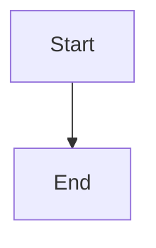

# Agent Context — strugglinghistorian.me

## What this project is

A personal blog and portfolio site for **Cedrick Jumtock**, built with [Hugo](https://gohugo.io) and hosted on GitHub Pages at [strugglinghistorian.me](https://strugglinghistorian.me). The site brand is **The Struggling Historian** — a history-focused blog covering African history, colonialism, digital humanities, and the intersection of technology and historical methodology.

## Tech stack

| Layer | Tool |
|-------|------|
| Static site generator | Hugo v0.163+ (extended) |
| Theme | [PaperMod](https://github.com/adityatelange/hugo-PaperMod) (git submodule in `themes/PaperMod/`) |
| Hosting | GitHub Pages |
| CI/CD | GitHub Actions (`.github/workflows/deploy.yml`) |
| Custom domain | `strugglinghistorian.me` (CNAME in `static/CNAME`) |
| Diagrams | Mermaid (via render hook in `layouts/_default/_markup/render-codeblock-mermaid.html`) |
| Code highlighting | Hugo built-in (Chroma, Dracula theme) |

## Directory layout

```
strugglinghistorian.me/
├── archetypes/default.md       ← template for new posts (hugo new content ...)
├── assets/                     ← global CSS/JS/images processed by Hugo pipeline
├── content/
│   ├── about.md                ← About page
│   ├── search.md               ← Search page (PaperMod built-in)
│   └── posts/                  ← all blog posts (Page Bundles recommended)
│       └── my-post/
│           ├── index.md        ← post content + front matter
│           └── cover.jpg       ← post cover image (optional)
├── layouts/
│   ├── _default/_markup/
│   │   └── render-codeblock-mermaid.html   ← Mermaid render hook
│   └── partials/
│       ├── extend_footer.html  ← injects Mermaid JS only on pages that need it
│       └── mermaid.html        ← Mermaid initialisation script
├── static/
│   └── CNAME                   ← custom domain for GitHub Pages
├── themes/PaperMod/            ← theme (do not edit — override via layouts/)
├── .github/workflows/
│   └── deploy.yml              ← CI/CD: builds on push to main, deploys to Pages
├── hugo.toml                   ← main configuration
├── .gitignore
└── agent.md                    ← this file
```

## Author

- **Name**: Cedrick Jumtock
- **Brand**: The Struggling Historian
- **GitHub**: https://github.com/namkatcedrickjumtock
- **LinkedIn**: https://www.linkedin.com/in/namkatcedrick/
- **Sessionize**: https://sessionize.com/cedrick/
- **Email**: cedrickjumtock+dev01@gmail.com

## How to create a new post

```bash
hugo new content posts/my-post-title/index.md
```

This creates a Page Bundle (folder + index.md) using `archetypes/default.md`. Place images for the post inside the same folder.

## Publish / unpublish system

Posts are controlled by the `draft` field in front matter:

```toml
draft = true   # hidden — not built, not deployed
draft = false  # live — built and deployed
```

- **To publish**: set `draft = false` and push to `main`
- **To unpublish**: set `draft = true` and push to `main`
- **Preview drafts locally**: `hugo server -D`

## Post front matter reference

```toml
+++
title = "Post Title"
date = 2026-06-22T10:00:00+00:00
draft = false
description = "One-sentence summary shown in listings and SEO meta."
tags = ["tag1", "tag2"]
categories = ["essays"]
series = ["optional-series-name"]
showToc = true

# Cover image (place image file in same folder as index.md)
[cover]
  image = "cover.jpg"
  alt  = "Alt text for accessibility"
  caption = "Caption shown under the image"
+++
```

## Mermaid diagrams

Use a fenced code block with `mermaid` as the language:

````markdown

````

The render hook in `layouts/_default/_markup/render-codeblock-mermaid.html` handles this. Mermaid JS is loaded lazily only on pages that contain a diagram.

## Code blocks

Standard Markdown fenced code blocks with a language identifier:

````markdown
```python
print("Hello, historian.")
```
````

Hugo's Chroma highlighter renders these with the **Dracula** colour scheme and line numbers enabled. Copy-to-clipboard is active by default.

## Images in posts

Place images in the post's folder (Page Bundle pattern):

```
content/posts/my-post/
├── index.md
├── cover.jpg        ← used as cover image via front matter
└── figure-1.png     ← referenced in body with standard Markdown
```

In the post body:
```markdown

```

## Theme overrides

Never edit files in `themes/PaperMod/` directly. Override by creating a file at the same relative path under `layouts/` or `assets/`. PaperMod provides two empty extension points:

- `layouts/partials/extend_head.html` — inject into `<head>`
- `layouts/partials/extend_footer.html` — inject before `</body>`

## Deployment

Push to `main` → GitHub Actions builds the site with `hugo --gc --minify` → deploys `public/` to GitHub Pages → available at `strugglinghistorian.me`.

Draft posts (`draft = true`) are never included in production builds.

## Local development

```bash
# Install Hugo (macOS)
brew install hugo

# Serve with drafts visible
hugo server -D

# Build for production (output goes to public/)
hugo --gc --minify
```
