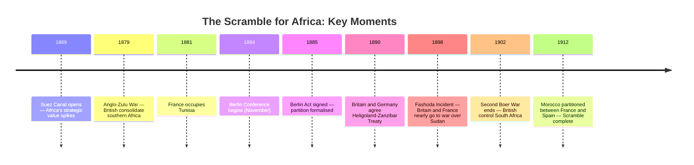
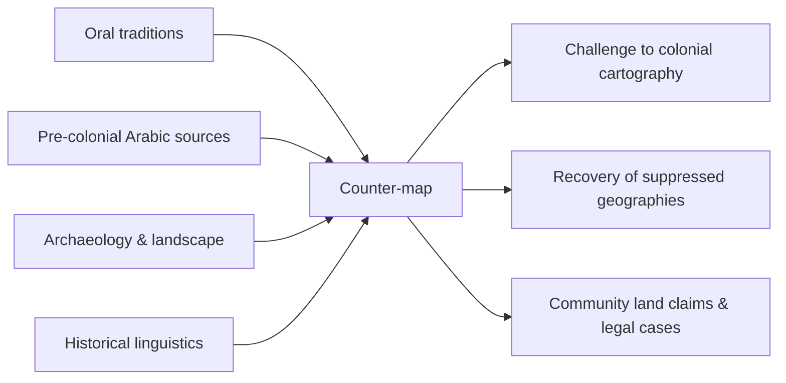

## Before the Line

Ask someone to draw Africa from memory and they will almost always draw the coastline first — the shape they learned from maps. But that coastline was drawn by Europeans, for Europeans, to track the movement of ships. The interior was, for centuries, labelled *terra incognita*: unknown land.

It was not unknown to the people who lived there.

This is the founding paradox of colonial cartography: the map that claimed to reveal the continent was the same map that erased the continent's existing geographies of knowledge — the trade routes, the pilgrimage paths, the seasonal pastoral movements, the named places that appear in no European atlas.

---

## The Berlin Conference: Drawing Lines on People

In 1884–85, representatives of fourteen European powers met in Berlin to formalise the partition of Africa. Not a single African representative was present.

The result was a set of borders drawn with reference to rivers, meridians, and the negotiating positions of distant governments — not to the ethnic, linguistic, or political geographies that actually organised African life.

What those lines produced is still with us. The borders of contemporary African states — in the overwhelming majority of cases — follow the Berlin geometry, not any prior political logic. The consequences: civil wars fought across communities the map had split, states that enclosed dozens of languages and hundreds of ethnic identities with no common political history, minorities and majorities manufactured overnight by the cartographer's pen.

---

## How the Map Argued

The colonial map was not a neutral document. It was a rhetorical object — an argument made in ink.

Several techniques were standard:

**Emptiness as claim.** Interior regions depicted as blank — without towns, roads, or place names — were not actually empty. They were strategically emptied, on paper, to justify the claim that they needed to be *brought into* civilisation by a European power.

**Colour and control.** The convention of colouring territories by metropolitan power — pink for Britain, blue for France, yellow for Portugal — transformed contested spaces into administered ones. The colour did not follow the conquest; often it preceded it, staking a claim to territory not yet controlled.

**Renaming.** The systematic replacement of African place names with European ones was not incidental to colonialism — it was part of the epistemological project. To name is to claim. The Nile stayed the Nile because Europeans had known it since antiquity. Dozens of rivers, mountains, and lakes lost their names entirely.

---

## Comparative Territorial Control (1880 vs 1913)

The speed of the Scramble is almost impossible to convey in words. These numbers are more legible:

| Year | European-controlled territory (% of Africa) |
|------|---------------------------------------------|
| 1870 | ~10% |
| 1880 | ~20% |
| 1895 | ~75% |
| 1913 | ~90% |

Only Ethiopia and Liberia remained formally independent by 1913. The rest had been partitioned, administered, and cartographically absorbed in less than forty years.

---

## Counter-Mapping

The historiographical response to colonial cartography has, in recent decades, moved toward what scholars call *counter-mapping*: the recovery and reconstruction of African spatial knowledge systems suppressed by the colonial archive.

This is painstaking work. It involves:

- Oral history and testimony about place names and their meanings
- Archaeological survey of road and settlement patterns that predate colonialism
- Cross-referencing Arabic-language sources from the trans-Saharan trade network
- GIS reconstruction of precolonial political boundaries from historical linguistics

The stakes are not merely academic. In multiple countries, counter-mapping research has been introduced as evidence in land rights cases — where communities are attempting to establish prior occupancy of territories claimed by the state or by private interests.

The map that erased them is being redrawn, slowly, from the inside.

---

## What We Inherit

Every time we look at a political map of Africa, we are looking at the outcome of the Scramble. The borders feel natural because they are old — not because they were ever right.

The historian's task is not to pretend those borders don't exist — they do, and the political communities that have grown up within them are real. It is to refuse the amnesia that treats the lines as inevitable, or as the starting point of African history rather than a violent interruption of it.

The land was always named. The names are still there, underneath.
