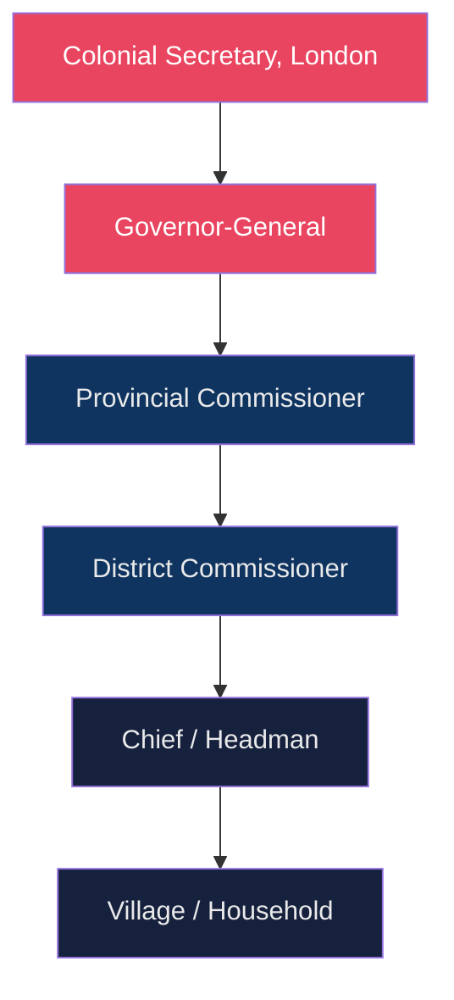

## The Problem with the Clean Dataset

Every historian who has worked with colonial archives knows the feeling: you open the ledger, and half the names are missing. Not redacted — just never recorded. The overseer wrote *two women* where there were women with names. The tax roll lists a household by the head alone. The census skips entire settlements.

Digital humanities arrived with a promise: at scale, we can surface what was buried. And in many cases, that promise holds. Named entity recognition can pull thousands of names from digitised newspapers in minutes. Network analysis can map connections across decades of correspondence. Geographic information systems can show you exactly where the land grabs happened.

But here is what the algorithm cannot do: it cannot fill a gap that was deliberately made.

---

## What Gets Quantified

When we build a dataset from colonial records, we are — whether we admit it or not — inheriting the epistemology of the coloniser. The categories were theirs. The things worth counting were theirs.

Consider the classic example of census data in British colonial Africa. The categories of *tribe*, *race*, and *civilisation* were not discovered — they were invented and then enforced through enumeration. When a digital humanist builds a database from those records, the database carries that violence inside it, quietly, in the column headers.

```python
# A dataset built from colonial census records
import pandas as pd

df = pd.read_csv("british_east_africa_census_1921.csv")

# This looks neutral. It is not.
print(df["tribe"].value_counts())
```

The code runs. The output looks authoritative. But the category `tribe` was itself a colonial technology of control — designed to fix identities that were fluid, to separate populations that traded and intermarried, to create administrative units that mapped onto neither culture nor politics.

The algorithm has no way to know this. The historian must.

---

## Mapping the Structure of Colonial Administration

To understand why this matters at scale, consider the administrative structure of a typical British colonial territory. The flow of information — and therefore the flow of what gets archived — followed the chain of command:



Notice where the archive is densest: at the top. The Colonial Secretary's dispatches are preserved in meticulous bound volumes at the Public Records Office. The District Commissioner's monthly reports are reasonably intact. But the village — where most people actually lived — is almost entirely absent from the formal record.

Digital tools let us process the top of this chain at extraordinary speed. The silence at the bottom remains.

---

## The Silences That Scale

Paul Gilroy wrote that "the archives which researchers must construct from oral testimony, music, and the limited written sources that survive are necessarily incomplete." This was true before the digital turn. It remains true after it.

What digital scale adds is a new kind of danger: the appearance of comprehensiveness.

When a database contains 200,000 records, it *feels* complete in a way that a folder of 200 documents does not. The confidence of the interface — the clean search bar, the dropdown filters, the exportable spreadsheet — militates against the humility the archive demands.

> The gap is not a bug in the dataset. It is the primary historical evidence.

The absence of African women from the colonial tax rolls is not a limitation to be apologised for in a footnote. It is one of the central facts of colonial political economy — that women's labour was rendered invisible precisely so it could be extracted without legal obligation.

---

## What This Means for Practice

None of this is an argument against using digital tools. It is an argument for using them with historical consciousness.

Concretely, that means:

1. **Document the silences explicitly.** A database should record not just what is present but what categories of person, place, or event are systematically absent — and why.
2. **Question the categories before you code them.** If your dataset has a column called `tribe`, you need a methodology section that explains the historical construction of that category, not just a data dictionary entry.
3. **Triangulate with non-textual sources.** Oral history, material culture, and landscape can speak to what the written record suppresses. Digital tools can help here too — GIS, audio archives, photogrammetry — but only if the historian knows to look.
4. **Be honest about what the model can and cannot do.** Topic modelling a corpus of District Commissioner reports will tell you what District Commissioners thought about. It will not tell you what the people they administered thought about. That is a different question requiring different sources.

---

## Conclusion

The archive and the algorithm are both tools. Neither is neutral, and neither is sufficient on its own. The historian's job — now as before — is to know what the tool was made for, who made it, and what it cannot see.

The struggle, as always, is in the gap.
