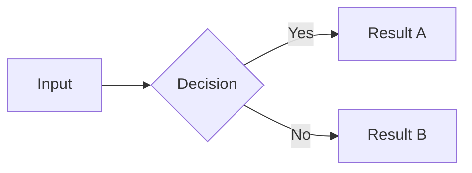

# Skill: Diagrams and Images

## Diagram tool decision tree

```
Is the diagram a flow, hierarchy, timeline, or sequence?
    YES → Use Mermaid (code block, renders in browser)
    NO  ↓

Is it a simple box-and-arrow structure (< 10 nodes)?
    YES → Use GoAT (Hugo-native, no JS, SVG output)
    NO  ↓

Is it a complex custom diagram (map, architecture, custom layout)?
    YES → Use Draw.io → export SVG → embed as image
```

---

## Mermaid

Fenced code block with `mermaid` language:

````markdown

````

**Supported types and when to use them:**

| Type | Syntax keyword | Best for |
|------|---------------|---------|
| Flowchart | `flowchart LR` / `flowchart TD` | Processes, decisions, admin hierarchies |
| Sequence | `sequenceDiagram` | Interactions between actors over time |
| Timeline | `timeline` | Historical chronology |
| Gantt | `gantt` | Project or phase planning |
| Class diagram | `classDiagram` | Domain model relationships |
| State diagram | `stateDiagram-v2` | States and transitions |
| ER diagram | `erDiagram` | Data relationships |
| Mindmap | `mindmap` | Concept maps |

**Theme**: Mermaid is configured to use dark theme matching the site. It auto-detects the current light/dark mode on page load.

**Troubleshooting**: If a diagram shows as raw code, check that:
1. The fenced block language is exactly `mermaid` (lowercase)
2. The Mermaid syntax is valid — use [Mermaid Live Editor](https://mermaid.live) to test

---

## GoAT (ASCII diagrams)

Fenced code block with `goat` language. Hugo renders to inline SVG — no JS, no CDN, works offline.

````markdown
```goat
+----------+     +----------+
|  Source  | --> |  Output  |
+----------+     +----------+
```
````

GoAT supports: boxes, arrows, labels, trees, networks. Syntax reference: https://github.com/bep/goat

---

## Draw.io (complex custom diagrams)

1. Design at https://draw.io or in Draw.io desktop app
2. **File → Export as → SVG**
   - Check "Include a copy of my diagram" (enables future editing)
   - Uncheck "Shadow" (cleaner export)
3. Place the `.svg` file in the post folder
4. Reference in post: ``

The SVG renders as an inline image — scales cleanly on all screen sizes, no JS required.

---

## Screenshots and photos

**Workflow:**

1. Take screenshot or acquire photo
2. Name descriptively: `census-ledger-1921.png` not `screenshot1.png`
3. Place in the post folder alongside `index.md`
4. Reference in post body:
   ```markdown
   
   ```
5. For the cover image, reference in front matter:
   ```toml
   [cover]
     image   = "cover.jpg"
     alt     = "Alt text"
     caption = "Source or caption"
   ```

**Alt text guidelines:**
- Describe what is *shown*, not what it *means* — screen readers need factual description
- Good: `"A page from the 1921 British East Africa census, showing household columns with missing names"`
- Bad: `"Colonial census showing erasure"`

**Format recommendations:**
- Photos: `.jpg` (smaller file size)
- Screenshots, diagrams with text: `.png` (lossless, crisper text)
- Logos, icons: `.svg` where possible

**Size**: Hugo (extended) has built-in image processing but PaperMod uses it automatically for cover images. For body images, any reasonable resolution works — keep under 2MB per image.
