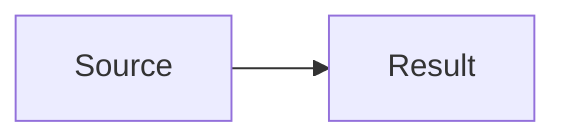

# Conventions

## Post structure

Every post is a **Page Bundle**: a folder containing `index.md` plus any images or files the post uses.

```
content/posts/<slug>/
├── index.md      ← post content + front matter
├── cover.jpg     ← cover image (optional but recommended)
└── figure-1.png  ← any additional images referenced in the post body
```

Single-file posts (`content/posts/my-post.md`) are allowed for short posts with no images.

## Slug naming

- Lowercase only
- Words separated by hyphens
- Descriptive but concise: `mapping-empire` not `post-about-how-colonial-maps-worked`
- No dates in the slug (dates live in front matter, not the URL)

## Front matter (TOML)

All posts use TOML front matter delimited by `+++`:

```toml
+++
title       = "Post Title — Subtitle if needed"
date        = 2026-06-22T10:00:00+00:00
draft       = true                          # always start as draft
description = "One sentence. Shown in listings and SEO meta."
tags        = ["tag1", "tag2"]
categories  = ["essays"]                   # or "history", "digital-humanities", "methodology"
series      = []                           # optional multi-part series
showToc     = true                         # show table of contents

[cover]
  image   = "cover.jpg"                   # relative to the post folder
  alt     = "Alt text describing the image"
  caption = "Caption shown under the cover image"
+++
```

## Tags vs categories

- **Tags** are specific and many (`colonial-africa`, `berlin-conference`, `gis`, `cartography`)
- **Categories** are broad and few. Currently: `essays`, `history`, `digital-humanities`, `methodology`
- Use 2–5 tags per post; 1 category per post

## Images

- **Cover image**: `cover.jpg` or `cover.png` in the post folder, referenced in front matter
- **In-post images**: standard Markdown `` — file is a page resource in the same folder
- **Screenshots**: Same as in-post images — store in the post folder, reference by filename
- **Alt text**: always required — describe what the image shows, not what it means
- **Captions**: use when the image needs context the alt text can't carry

## Diagrams

### Mermaid (code-generated)

Fenced code block with `mermaid` language identifier:

````markdown

````

**Supported diagram types**: flowchart, sequenceDiagram, timeline, gantt, classDiagram, stateDiagram, erDiagram, mindmap, xychart-beta

Mermaid JS is injected automatically at runtime only on pages that contain a `.mermaid` element.

### GoAT (ASCII diagrams, Hugo-native)

Fenced code block with `goat` language identifier. Hugo renders to inline SVG — no JS, no CDN, works offline:

````markdown
```goat
      .---.
     /     \
    /  Box  \
    \       /
     \     /
      '---'
```
````

Use GoAT for simple structural diagrams where Mermaid is overkill.

### Draw.io → SVG (complex custom diagrams)

1. Design in [Draw.io desktop](https://get.diagrams.net/)
2. Export → SVG (check "Include a copy of my diagram")
3. Place the `.svg` file in the post folder
4. Reference it in the post body: ``

## Code blocks

Language identifier on every fenced code block. Common identifiers: `python`, `bash`, `toml`, `yaml`, `javascript`, `sql`, `go`, `markdown`.

Line numbers are on by default (configured globally). To disable for a specific block, this is a Hugo limitation — not supported per-block without a shortcode.

## Writing style

- Write in full sentences, not bullet points for prose sections
- Use bullet lists for: steps, enumerations, reference lists — not for continuous argument
- Blockquotes for direct quotations from sources
- **Bold** for key terms on first use; not for emphasis in prose
- One H2 heading per major section; H3 for subsections within a section
- The description field should be one complete sentence — not a fragment, not two sentences

## What NOT to commit

- `public/` — generated output, in `.gitignore`
- `resources/` — Hugo asset cache, in `.gitignore`
- `.DS_Store` — macOS metadata, in `.gitignore`
- Draft posts are committed but not deployed (`draft = true` is safe to push)
